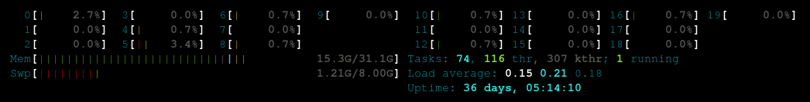

# How to Homelab

I'd say that homelabbing is by far the best and fastest way to gain confidence with Linux system and system administrator tasks. Want to learn how Docker works? Just take a small, unused laptop, install Linux on it and start experimenting. Want to understand how WireGuard VPNs work? You can configure NAT on your router to expose the server's WireGuard port and see if it works. The possibilities are virtually endless.

## My Infrastructure

I have homelabbed a lot in the past, mainly with some poor-man's solution. Up until not long ago, my server consisted simply of a very tiny [Raspberry Pi 4](https://www.raspberrypi.com/products/raspberry-pi-4-model-b/) with a mere 4 GB of RAM, which allowed me to run only Home Assistant and a couple of Docker services. Then, I was gifted a Raspberry Pi 5 by my girlfriend (yes, I like ARM devices), meaning that I suddenly had a lot more to experiment with (those whopping 16 GB of RAM used to look like a dream to my broke self). Finally, the latest addition to my setup was provided by a friend of mine, who decided to hand me a not-so-old-but-unused Lenovo laptop, which is by far the most powerful component I could ever dream of:

## The Tools

Once all of these hosts got up and running, a new question arose: how should I split tasks between them? This single doubt (along with some other university tasks) paralyzed my homelab for a couple of months, until I finally decided to lay out a plan to restructure my infrastructure to make it reproducible and clear. To do this, I wanted to explore and adopt three main tools:

- [Proxmox](https://www.proxmox.com): arguably my favorite tool of the stack. Proxmox allowed me to make the most of the Lenovo machine by dynamically deploying several VMs on it without the pain of manually managing KVM/LXC.
- [OpenTofu](https://opentofu.org): the FOSS alternative to Terraform, the go-to tool to deploy virtual machines declaratively. Since I will be using Proxmox to deploy VMs, it becomes mandatory to have a tool that makes deployment easier (with OpenTofu, it just becomes `tofu apply`, sort of).
- [Ansible](https://docs.ansible.com/): once the VMs are deployed, Ansible manages the installation and configuration phases. It works by writing small pieces of YAML configuration files, called playbooks, which serialize a list of instructions to be executed via SSH on a single host. I would use this to, for example, install Docker on a deployed VM on Proxmox.
- [Komodo](https://komo.do): a tool that I've been exploring for a bit with my CTF team to simplify Docker container deployment. Komodo allows you to import Docker Compose stacks from Git and run them in a distributed way. It also supports a Terraform-inspired syntax using TOML to declaratively specify which resources should be loaded into the software.
- Git: which needs no introduction. The files that describe the final infrastructure will be saved in (hopefully self-hosted) repositories.
- [Forgejo](https://forgejo.com): to store the selfhosted repository and run CI/CD to execute both OpenTofu and Ansible directly inside the infrastructure.

## The (almost) Final Plan

Now that the tools and the machines are in line, the restructuring plan would become something like this:

1. The main Lenovo server, which we can call from now on "**Lancelot**", will be reserved to Proxmox. The idea is to host on it at least two VMs, using OpenTofu:
    1. A Docker machine, which becomes the main playground to host various services using Docker, Ansible and Komodo.
    2. A pfSense router, to create an internal subnet for the private Homelab network. Since networking can become a real pain, this part will probably be better described in another post.
2. The Raspberry Pi 5, which we can call from now on "**Zero**", will become a sort-of orchestrator. It will host the Git server and the runner, so that the CI/CD can execute actions directly on Proxmox or the internal VM.
3. The Raspberry Pi 4, which we can call from now on "**Guren**", will be dedicated to running Home Assistant, since it's definitely too tiny to have it host anything else.

Yes, the names are borrowed from Code Geass btw.

This will be the first post of a series. The following posts will go into more detail on how this plan shall take place. For now, thanks for following :)
