# Configuring Software

Now that the plan for the Homelab is fully outlined, the next steps include the installation of the first two pieces of software required to bootstrap everything else about the lab: [Proxmox](#proxmox) and [the pfSense router](#pfsense).

But before that, it is worth talking about another component that has to be set up, and that is the [TP-Link repeater](#repeater).

## TP-Link Repeater

The setup of the TP-Link repeater was rather straightforward. Once it is turned on for the first time, it allows connecting to an open network and starting the initialization. For the setup, I will just repeat the signal of the Wi-Fi network with the same SSID:

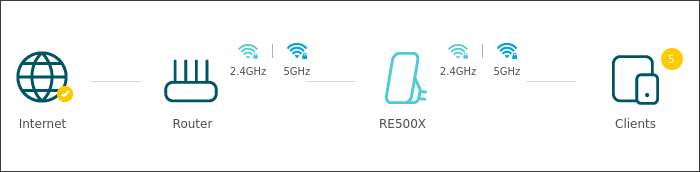

Before closing this part, I tweaked some of the configuration settings to make the setup a bit more stable. These include:

- Setting up a static IP address: this way the repeater is guaranteed to be given the same address every time, in this case `192.168.0.41`
- Turning off the DHCP server: to make sure that the ISP router is the only device assigning IP addresses inside the home network, the repeater's DHCP service is turned off
- Reducing the power of the router's Wi-Fi signal, since connections only happen via Ethernet

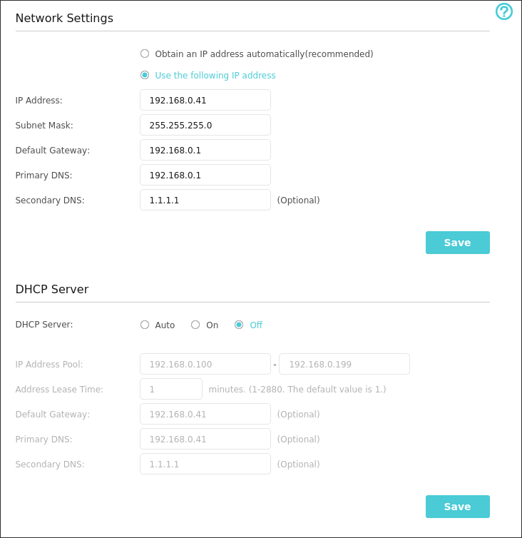

Now that the repeater is set up, the Lenovo laptop (**Lancelot**) can be connected to it via Ethernet.

> [!NOTE] On bandwidth
> Obviously, using the repeater to connect the Lenovo laptop has a cost in terms of speed. The best solution overall to maintain the network speed as much as possible would be to cable the house and link the Lenovo directly to the router.

## Proxmox

Once Lancelot was connected to the repeater, installing Proxmox was straightforward: just download the [official ISO](https://www.proxmox.com/en/downloads/proxmox-virtual-environment/iso), flash it on a drive, and follow the installation instructions. I went with the default options: I named my main VM node `pve` and called the bridge network to the home LAN `vmbr0`. Since I did not purchase a license, I also had to add the `no-subscription` APT repositories to receive updates.

### Disks

Disk-wise, Lancelot has a single SSD with `2.0 TB` of space. To start easy, the disk was partitioned to create a single LVM partition containing almost the entirety of the disk space:

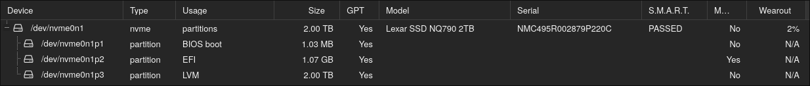

The `nvme0m1p3` partition is then used to create two storage `pools`:

- `local`: the pool used to store backups, imports, ISO images, and LXC templates. Total size: `100 GB`
- `local-lvm`: the pool used for VM disks. Total size: `1.9 TB`

### Recap graph

My final Proxmox installation can thus be summarized like this:


flowchart TD
    lancelot["Lancelot Proxmox node: pve"]
    bridge["vmbr0 Bridge to home LAN"]
    ssd["2 TB NVMe SSD"]
    lvm["LVM partition"]
    local["local 100 GB ISOs, templates, backups"]
    local_lvm["local-lvm 1.9 TB VM disks"]

    lancelot --> bridge
    lancelot --> ssd --> lvm
    lvm --> local
    lvm --> local_lvm


## pfSense

Once Proxmox was set up, I moved on to creating a `pfSense` virtual machine that would act as my homelab's internal network router. I will skip explaining details on how I created the VM: it is as simple as downloading the ISO and creating a new VM. The specifics I chose for this machine are:

- `2` vCPU cores
- `4 GB` of RAM
- `32 GB` of disk space

### Virtual Bridges

Before creating the VM, Proxmox must be aware of the fact that we will be operating on two different networks: the home one and the homelab one. This requires two physical NICs and two separate bridges:

- `vmbr0`: this is the main network bridge that handles traffic towards the home LAN. It covers the subnet `192.168.0.0/24`. To simplify IP management, the Proxmox host on this interface is given the static IP address of `192.168.0.137/24` and is able to reach the gateway at `192.168.0.1`. This address must be outside the ISP router's DHCP pool or reserved there.
- `vmbr1`: this is a VLAN-aware Layer 2 bridge for internal homelab traffic. It is connected to the Ethernet port going to the switch, which is configured as a tagged trunk for VLANs 10 and 20. The bridge has no IP address and does not own a subnet, and pfSense owns the routed VLAN interfaces on top of this trunk.

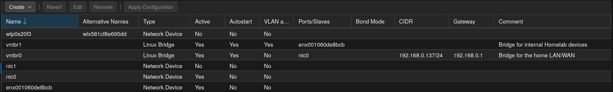

The pfSense VM can then be created with two separate network devices: the pfSense installation will prompt the user to choose which one handles the WAN (the home network) and the LAN trunk (the homelab network):

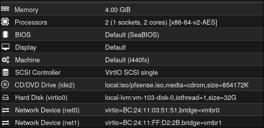

### Setup

Once the pfSense installation was completed, it was time to change a couple of components to suit my needs.

#### Miscellaneous

For starters, I decided to move the default listening port of pfSense from 443 to `8443`: this way port `443` is free to be allocated via NAT to any other internal VM. I also decided to specify a static IP for the WAN interface, `192.168.0.73/24`, which is outside the ISP router's DHCP pool or reserved there.

Protection-wise, I enabled SSH access through port `2222`, allowing only users with authorized SSH keys and disabling password authentication. I also implemented the default brute-force protections for the login screen:

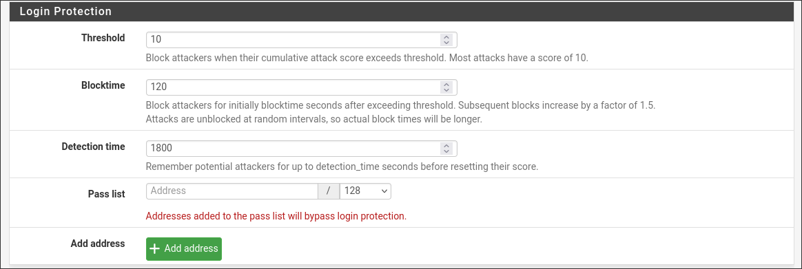

To harden the account even more, I disabled access from the `admin` user and created a new one with admin privileges.

Another very useful option to enable is automatic configuration backup on pfSense servers. By supplying an encryption key, I can keep a version of my configuration and roll back in case anything bad happens.

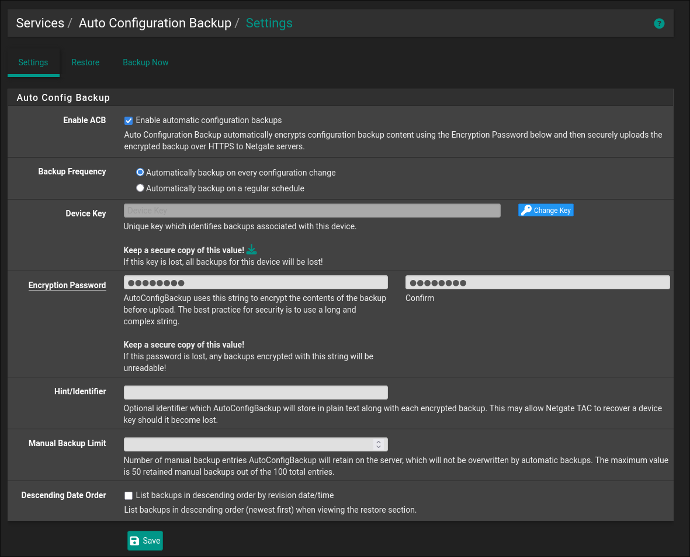

#### VLANs

Once pfSense was running, I went to set up the two VLANs that were previously described, `10` and `20`:

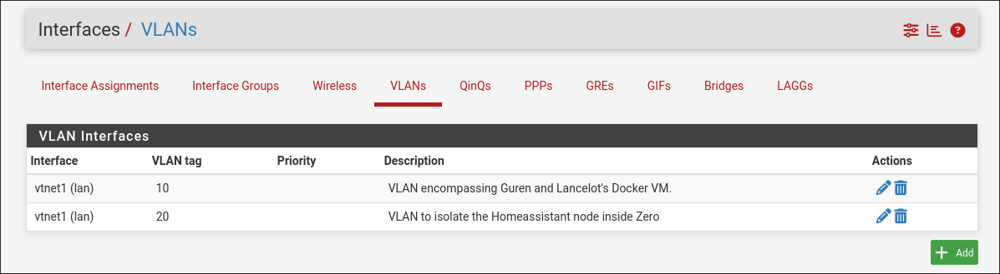

The pfSense LAN vNIC is connected to `vmbr1` without a Proxmox VLAN tag, allowing pfSense to receive the VLAN trunk. The physical uplink from `vmbr1` to the switch then carries tagged VLANs 10 and 20.

Once the VLANs are created, it is necessary to assign them to two new interfaces, which pfSense uses to route the network segments. I created the interfaces `HOMELAB_VLAN10` with the static address `192.168.10.1/24`, and `HOMELAB_VLAN20` with the static address `192.168.20.1/24`. Neither internal interface has an upstream gateway: pfSense is the gateway for its clients.

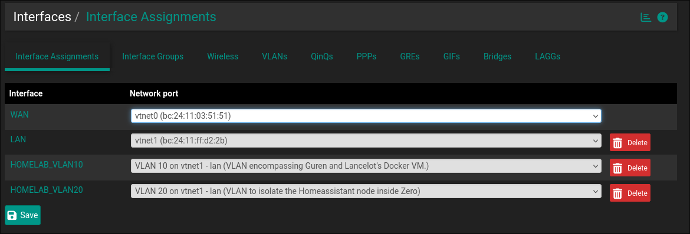

Once the VLAN interfaces are set up, pfSense creates an empty firewall ruleset for each one. By default, the router refuses to route packets arriving from either VLAN, which prevents connectivity to the WAN. Communication to pfSense is also blocked, meaning that hosts inside the VLANs cannot access services such as the DNS resolver on port 53. To avoid this, [pfSense docs](https://docs.netgate.com/pfsense/en/latest/recipes/example-basic-configuration.html#setup-isolating-lan-and-dmz-each-with-unrestricted-internet-access) recommend adding the following rules:

- Traffic towards the router for port `53` of both the `TCP` and `UDP` protocol
- Traffic towards the router following the `ICMP` protocol
- Traffic towards any host that is _not_ part of the following subnets, which are reserved for private networks:
    - `10.0.0.0/8`
    - `172.16.0.0/12`
    - `192.168.0.0/16`

In pfSense, these ranges are configured in a `Network(s)` alias, not a `Host(s)` alias, otherwise pfSense attempts to expand the ranges into individual addresses. The firewall rule uses this alias as its destination with **Invert match** enabled.

> [!NOTE] Intra-subnet Traffic
> Although this configuration theoretically blocks traffic _inside_ the same VLAN (i.e., `192.168.20.0/24` is a subnet of `192.168.0.0/16`) the traffic is actually not blocked, because two devices communicating inside the same network do not reach the pfSense router at all, since communications are handled by the switch (layer 2) and not the router (layer 3). This is explained in greater detail in [pfSense's official docs](https://docs.netgate.com/pfsense/en/latest/troubleshooting/firewall.html?utm_source=chatgpt.com#unfilterable-traffic).

To make rules more manageable (in case more VLANs have to be added in the future), I created an interface group named `ISOLATED_VLANS`, containing both `HOMELAB_VLAN10` and `HOMELAB_VLAN20`. This way, I could add firewall rules to it and have them apply to each VLAN. The final firewall rules look like this for both interfaces:

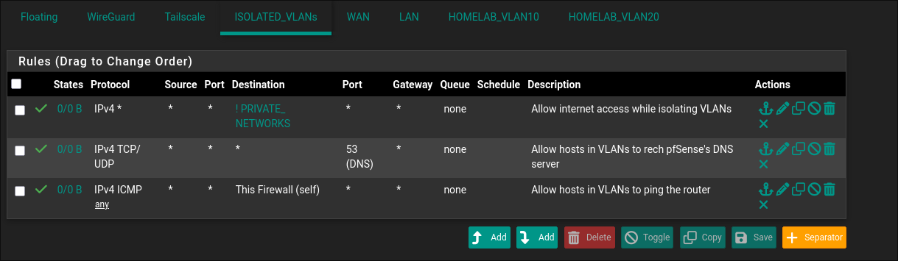

#### VPNs

Since the pfSense panel should not be exposed to the wider internet (for obvious security reasons), the best way to make it reachable from outside the home's LAN would be to enable connection to it through a VPN. The best choice for this is arguably [WireGuard](https://wireguard.com), but I decided to explore another self-hosted alternative, which would be [Tailscale](https://tailscale.com) with its open-source server, Headscale. The configuration of the Headscale server will be part of a future post because it cannot be run directly from pfSense; it has to be run on the Docker VM inside Proxmox. The only thing that can be done for now is to install the Tailscale package inside pfSense itself and come back to it once Headscale is ready.

#### DHCP

The DHCP server must not run on the WAN interface, since it is already managed by the ISP's router. Instead, DHCP is enabled separately for each internal VLAN interface. A DHCP pool is not a reservation: it is the range from which pfSense dynamically assigns client addresses.

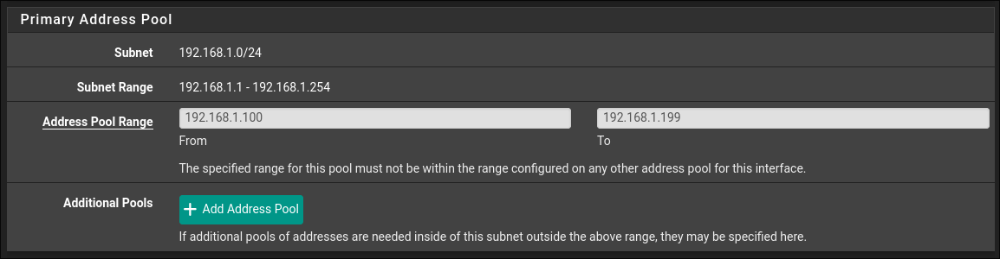

I configured the following DHCP pools:

- `HOMELAB_VLAN10`: `192.168.10.100-192.168.10.199`
- `HOMELAB_VLAN20`: `192.168.20.100-192.168.20.199`

Static mappings are only needed for devices that require a predictable address, such as the Docker VM, the Raspberry Pi 5, and the Raspberry Pi 4. They are configured on the respective VLAN's DHCP page by mapping a device MAC address to an address outside the dynamic pool, such as `192.168.10.10`, `192.168.10.11`, and `192.168.20.10`.

## Switch

To conclude the network configuration, I had to instruct the TP-Link switch on how to handle traffic for the different VLANs.

### General Configurations

As part of a general series of configurations, I assigned the switch management interface the static address `192.168.10.2/24` on VLAN 10. This address is outside the VLAN 10 DHCP pool and is reachable only from clients permitted to access that VLAN.

### VLANs

Since my switch has a total of `8` ports, the plan was something like this:

- Port `1` was dedicated to traffic from the Proxmox host's `vmbr1` bridge and is marked as carrying both VLANs `10` and `20`. This is a **trunk port**: it carries traffic for multiple VLANs and is therefore **VLAN-aware**, receiving Ethernet frames with tags that identify their VLAN. The switch uses the VLAN ID and destination MAC address to forward each frame to the appropriate port.
- Port `2` was dedicated to VLAN `10`, which contains the Docker VM inside Proxmox and the Pi 5 (**Zero**). The Docker VM is attached directly to `vmbr1` with VLAN tag `10`; the Pi 5 is the device physically connected to this switch port. Since port `2` is an access port, it carries _untagged traffic_ for VLAN `10` and has PVID `10`. The Pi 5 therefore remains **VLAN-unaware**.
- Port `3` was dedicated to VLAN `20`, which contains the Home Assistant Pi (**Guren**). Like port `2`, it is an access port that carries _untagged traffic_ for VLAN `20` and has PVID `20`.
- Ports `4-8` become debug ports: by configuring one as an untagged VLAN 10 access port with PVID `10`, I can attach a laptop and receive an address in `192.168.10.0/24`. A port can instead be assigned to VLAN 20 when testing that network.

> [!NOTE] On the Docker VM
> Since the Docker VM is hosted on the same Proxmox instance as pfSense, it must be attached to the VLAN-aware `vmbr1` bridge with VLAN tag `10`. This keeps it in the same Layer 2 network as the Pi 5 while pfSense remains responsible for routing between VLANs.

The final configuration from the switch's UI looks like this:

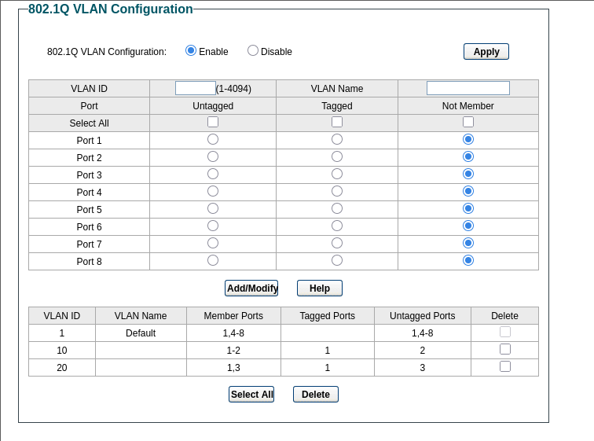

While the PVIDs are these:

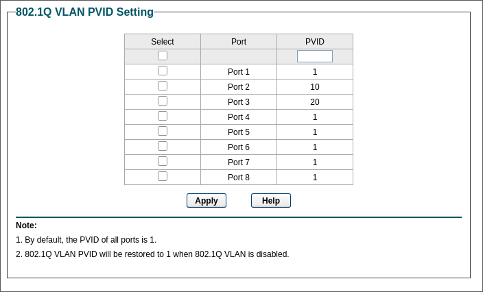

## Testing

To verify that the configuration is (at least partially) complete, I tried creating a small LXC container in Proxmox and attached it to VLAN `10`:

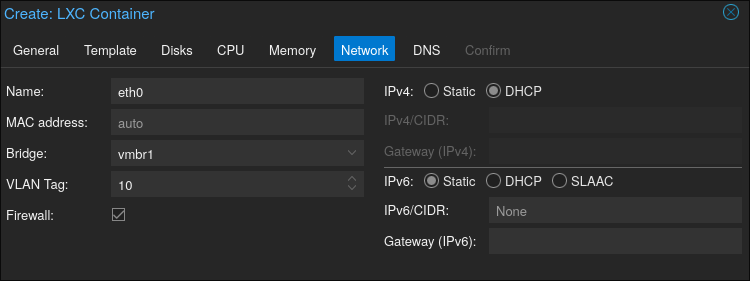

Once the container started I confirmed that network connectivity worked by verifying that the DHCP pool had reserved an address, and WAN connectivity worked successfully:

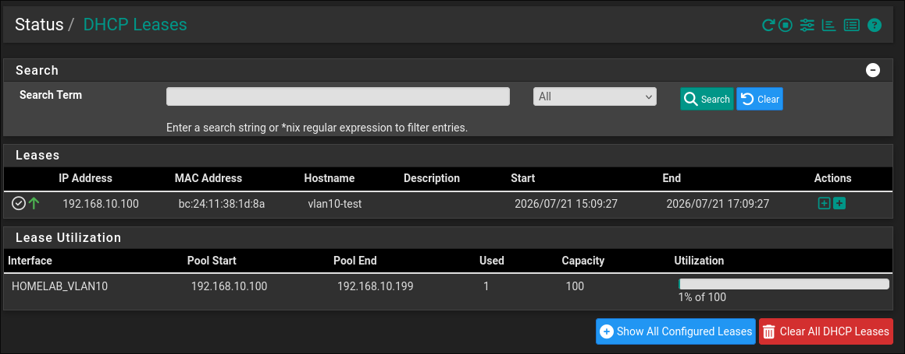

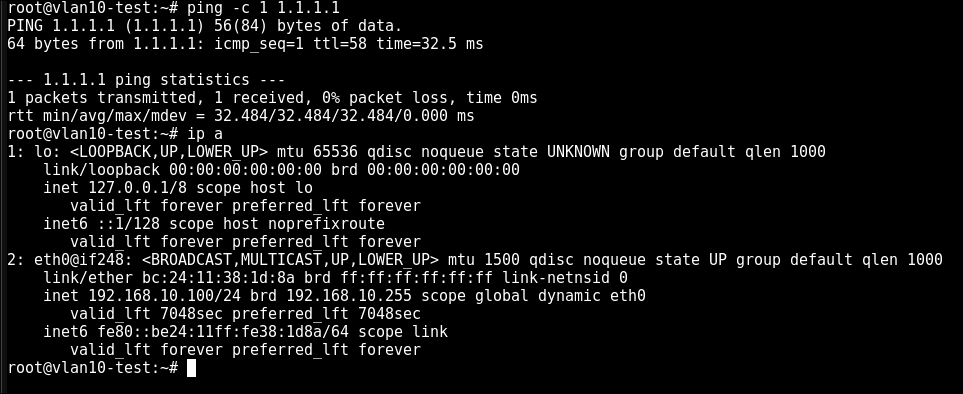

## Wrapping Up

The configuration should now be complete. In the next posts, I will test it by configuring the various hosts i outlined in previous sections to it. Thanks for following!
