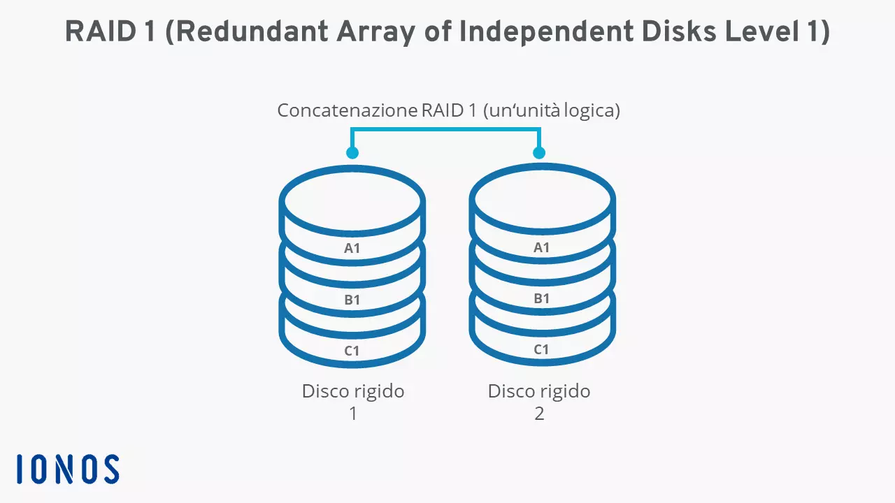
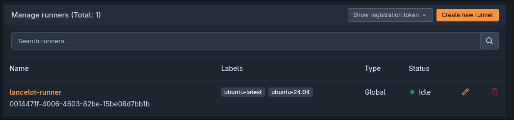
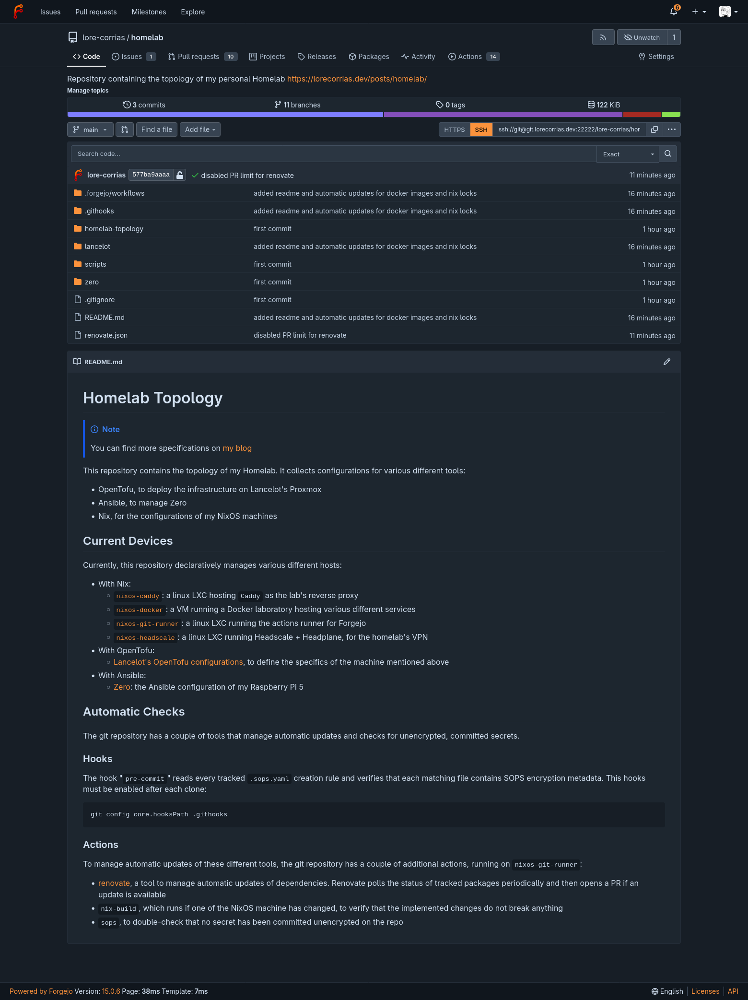
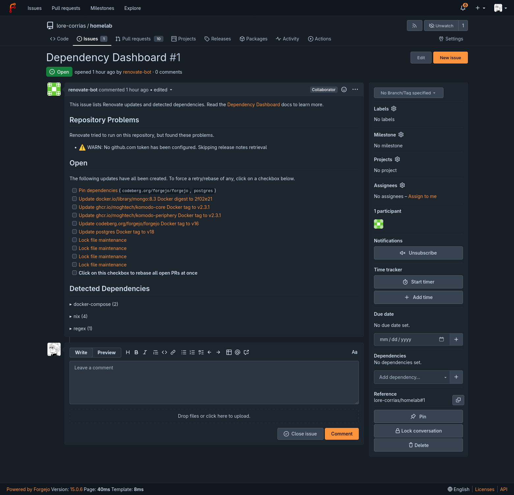
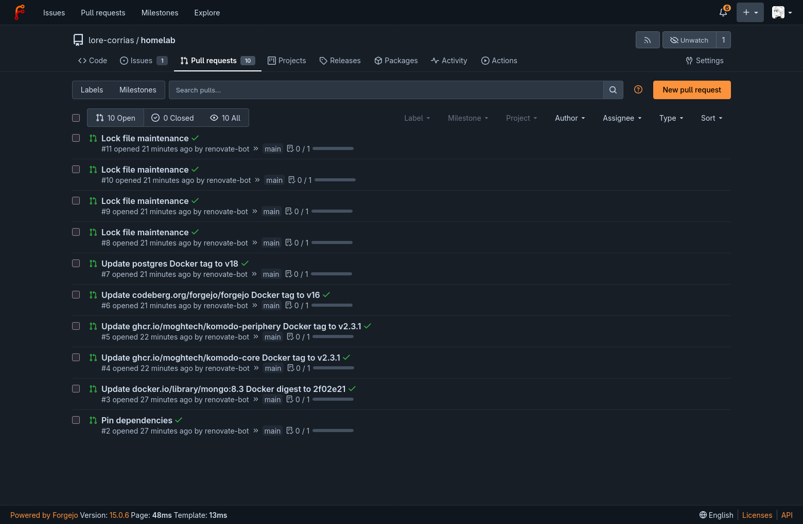
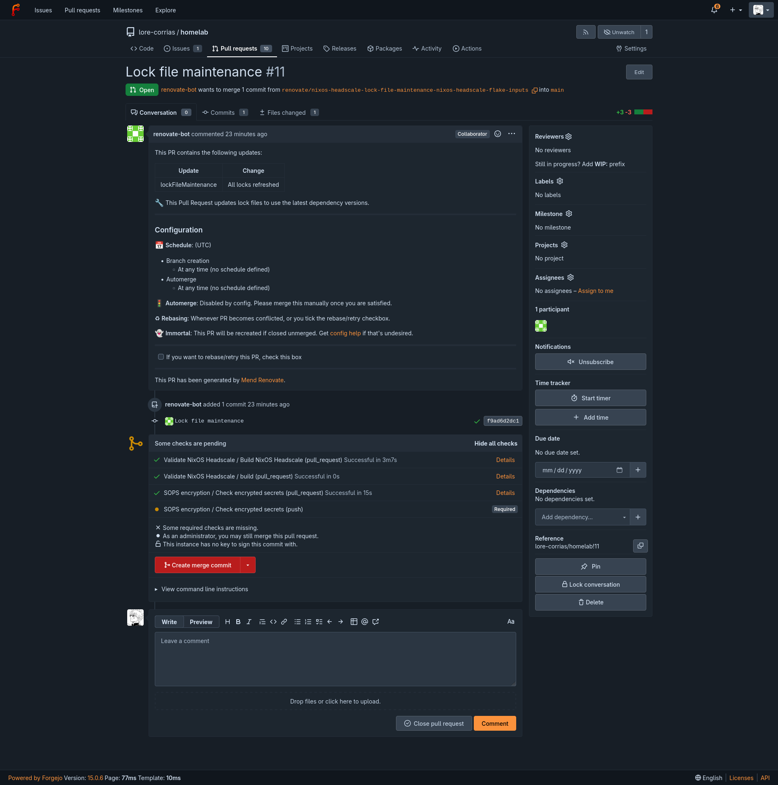

# ZFS on my Pi

Among the investments that I made for my personal homelab, I decided to try and buy a [SATA HAT](https://radxa.com/products/accessories/penta-sata-hat/), which is a small device that acts as a multiplexer for the Raspberry Pi's SATA interface, allowing one to connect multiple external drives without using USB. The reasoning behind the purchase was that I needed a new purpose for this piece of hardware: once Zero was fully set up, it would act as the main "computing power" on which to run all of the services/containers that were once hosted by this Pi 5. However, I didn't want to rely too heavily on a single host, and I still needed a place to save all the data produced in my homelabbing activities. This led me to choose to repurpose the Pi into a sort of "datacenter", which would be responsible for running all data-reliant applications. The contents of the databases would then be saved on external SSDs/HDDs connected through SATA.

## Tool Choice

### Why ZFS?

Mainly because I had a couple of disks ready to be used and didn't want to gamble too much on my house's not-so-reliable electrical grid. Using RAID is a good compromise between the space I need (which is not much; for now, 500 GB will do) and reliability. ZFS is probably the best choice for setting it up relatively straightforwardly (as shown by [Jeff Geerling's guide](https://www.jeffgeerling.com/blog/2021/htgwa-create-zfs-raidz1-zpool-on-raspberry-pi/)).

### OS and Management

Although I chose to experiment a bit in my previous posts by using NixOS, I preferred going back to the "safe choice" for this Raspberry Pi in order to avoid future headaches as much as possible by installing [Raspbian 13](https://www.raspberrypi.com/software/operating-systems/). Since I will be using a standard Debian-based OS, all configurations will be managed using Ansible for simplicity. I will also skip describing the installation steps (since they are a bit boring) and go straight to the configuration.

## Initial Configuration

All configuration steps described here were first executed manually and then automated through the use of Ansible. For this reason, I will publish the fully written modules only once they are finished in a future GitHub repository. Consider the code blocks nothing more than drafts.

### Hardening

Some of the first steps I take when managing a system with Ansible are hardening steps to make the system more secure. Since the Pi might be open to the WAN in the future, these steps are rather important.

#### Firewall

As a firewall, I decided to experiment with nft, which is the successor to the more well-known iptables. nft is generally considered a better alternative and makes creating persistent rules rather easy: just place a configuration file at `/etc/nftables.conf` and apply it.

The policies I chose to apply are rather restrictive for security reasons:

- By default, disallow any incoming and forwarded packets
- Allow DHCP connections
- Allow SSH connections only from the bastion host, with a rate limit of 5 new connections per minute
- Allow a number of TCP/UDP ports when the source address is the reverse proxy host
- Allow any already established connections
- Rate limit ICMP pings to 5 per second

The deployed configuration draft becomes something like that:

```
#!/usr/sbin/nft -f

flush ruleset

table inet filter {
  chain input {
    # By default, drop incoming packets
    type filter hook input priority filter; policy drop;

    # Block invalid conntrack packets
    # http://people.netfilter.org/pablo/docs/login.pdf
    ct state invalid drop
    # Accept incoming packets from established connections
    ct state { established, related } accept

    # Accept loopback traffic
    iifname "lo" accept

    # Allow DHCP communications
    iifname "{{ firewall.wired_interface }}" udp sport 67 udp dport 68 accept
    iifname "{{ firewall.wired_interface }}" udp sport 547 udp dport 546 accept

    # Allow traffic from port 22 only if passing through the
    # bastion host via SSH jumping
    # New connections are rate limited
    ct state new iifname "{{ firewall.wired_interface }}" ip saddr {{ firewall.bastion_host_address }} tcp dport 22 limit rate {{ firewall.ssh_rpm_limit }}/minute burst {{ firewall.ssh_burst_limit }} packets accept

    # Allow TCP/UDP ports for the reverse proxy host, so that it can access them
    
    ct state new iifname "{{ firewall.wired_interface }}" ip saddr {{ firewall.reverse_proxy_address }} tcp dport { {{ firewall.allowed_tcp_ports | join(', ') }} } accept
    

    
    ct state new iifname "{{ firewall.wired_interface }}" ip saddr {{ firewall.reverse_proxy_address }} udp dport { {{ firewall.allowed_udp_ports | join(', ') }} } accept
    

    # Handle icmp packets
    iifname "{{ firewall.wired_interface }}" jump icmp_input
  }

  chain forward {
    # By default, drop forward packets
    type filter hook forward priority filter; policy drop;

    # Block invalid conntrack packets
    # http://people.netfilter.org/pablo/docs/login.pdf
    ct state invalid drop
    # Accept forward packets from established connections
    ct state { established, related } accept
  }

  chain output {
    # By default, allow outgoing packets
    type filter hook output priority filter; policy accept;
  }

  # Rate limit ICMP requests to 3 per second
  chain icmp_input {
    icmp type echo-request limit rate 5/second accept
    icmpv6 type echo-request limit rate 5/second accept

    icmpv6 type {
      destination-unreachable,
      packet-too-big,
      time-exceeded,
      parameter-problem,
      nd-router-advert,
      nd-neighbor-solicit,
      nd-neighbor-advert
    } accept
  }
}
```

#### General and SSH

The steps I took to secure SSH were fairly standard:

- Limit access to SSH keys
- Disallow `root` from logging in
- Allow only user `lore` (the default one) to log in
- Restrict maximum authentication tries to `3`
- Some other unimportant settings, like disabling SSH tunnels

This was possible thanks to the [ansible-collection-hardening](https://github.com/dev-sec/ansible-collection-hardening/tree/master) role. In addition to SSH, I also run the general OS hardening module with default options, while making sure that the sysctl `net.ipv4.ip_forward` is set to 1 for Docker.

### APT

Since I decided to install a Debian-based OS, one of the first things I had to do was set up package updates and upgrades. After the system was installed, I ran an initial update via `apt update -y && apt upgrade -y`. I also added some packages that would be necessary for future configurations.

For future updates, I decided to configure [unattended upgrades](https://wiki.debian.org/PeriodicUpdates), which is a package that automates periodic updates and upgrades of APT packages. I decided that the update policy would be:

- At `02:00`, apt packages are updated
- At `03:00`, packages are upgraded
- At `04:00`, the system is rebooted (if necessary)

Putting this in Ansible was relatively easy thanks to [hifis.toolkit's role](https://galaxy.ansible.com/ui/repo/published/hifis/toolkit/content/role/unattended_upgrades/):

```yaml
- name: Install required packages
  ansible.builtin.apt:
    name:
      - zfs-dkms
      - zfsutils-linux
      - unattended-upgrades
      - fuse-overlayfs
      - uidmap
      - dbus-user-session
      - slirp4netns
      - iptables
      - acl
    state: present
    update_cache: true

- name: Install automatic apt updates
  ansible.builtin.include_role:
    name: hifis.toolkit.unattended_upgrades
  vars:
    # Prune unused packages
    unattended_remove_new_unused_dependencies: true
    unattended_remove_unused_kernel_packages: true
    # Update packages every day at 02:00 and upgrade them at 03:00
    unattended_systemd_timer_override: true
    unattended_apt_daily_oncalendar: "*-*-* 02:00"
    unattended_apt_daily_upgrade_oncalendar: "*-*-* 03:00"
    # Reboot the system when needed at 04:00
    unattended_automatic_reboot: true
    unattended_automatic_reboot_time: "04:00"
```

Of course, full system updates (like jumping to another Debian version) are still required to be run manually via the `raspi-config` utility.

### Boot Configurations

#### SATA HAT

The SATA HAT attached to the Raspberry Pi was, to my surprise, not automatically loaded by the firmware. In order to recognize external disks, it is necessary to add a [small section](https://www.raspberrypi.com/documentation/computers/raspberry-pi.html#enable-pcie) to `/boot/firmware/config.txt`:

```
[pi5]
dtparam=pciex1
```

> [!NOTE] PCIe Generation
> Technically, the better value for this parameter would be `pciex1_gen=3`, which enables Gen 3.0 speed (8 GT/s, against the 5 GT/s of 2.0), but the documentation specifies that the support is still unstable and not recommended. 

#### Disable WiFi and Bluetooth

Since Zero is connected via Ethernet, it is possible to disable Wi-Fi by editing `config.txt`. I also disabled Bluetooth in the same way:

```
dtoverlay=disable-wifi
dtoverlay=disable-bt
```

### ZFS

To install ZFS on Raspbian, there are some packages that are required:

```text {class="command-output"}
lore@zero:~ $ sudo apt install zfs-dkms zfsutils-linux
zfs-dkms is already the newest version (2.4.1-1~bpo13+1~rpt1).
zfsutils-linux is already the newest version (2.4.1-1~bpo13+1~rpt1).
Summary:
  Upgrading: 0, Installing: 0, Removing: 0, Not Upgrading: 0
lore@zero:~ $
```

Note that installing the ZFS kernel module requires building it from source, which takes a lot of time and CPU effort/heat (building spikes the CPU temperature to 85°C). This process, of course, is also done when the modules are updated.

The idea behind orchestrating my two `500 GB` SSDs using ZFS is to put them in a RAID 1 configuration. RAID 1 replicates the contents of one drive onto the other, effectively halving the total capacity but doubling reliability (if one of the two drives crashes, data is not lost):



The command to create the pool is:

```bash
sudo zpool create -n \
    -o ashift=12 \
    -O compression=lz4 \
    -O relatime=on \
    -O acltype=posixacl \
    -O xattr=sa \
    -O mountpoint=/tank \
    tank mirror \
    "$DISK1" "$DISK2"
```

This creates a pool with:

- `lz4` as the compression algorithm
- named `tank` and mounted on `/tank`
- `mirror` as a RAID system

The two disks are identified by their IDs:

```text {class="output-command"}
lore@zero:~ $ DISK1="/dev/disk/by-id/ata-TOSHIBA_MK5065GSX_301HC0XVT"
lore@zero:~ $ DISK2="/dev/disk/by-id/ata-TOSHIBA_MQ01ABF050_69HHTS5DT"
```

Now the directory under `/tank` can be used to save files on the two RAID disks. Usually, it would be better to use either `datasets` or `volumes` for snapshotting and better data management instead of relying on writing to the directory.

#### Snapshots

One of the many useful features of ZFS is its ability to take snapshots of the current state of a filesystem. Snapshots are very helpful in cases of temporary corruption (i.e., when an outage forces the shutdown of a database during writing), since they allow the state of any file to be rolled back to a previous configuration. A snapshot policy can be enforced automatically on a ZFS filesystem by using a tool named [Sanoid](https://github.com/jimsalterjrs/sanoid). It can be installed via the `sanoid` APT package and simply requires adding a `/etc/sanoid/sanoid.conf` file to specify the snapshot policy. Sanoid will then automatically run every 15 minutes and snapshot or prune old snapshots according to the policy. For example, this is the policy for Docker storage:

```ini
[storage/docker]
autosnap = yes
autoprune = yes
frequently = 0
hourly = 24
daily = 7
weekly = 4
monthly = 6
yearly = 0
```

#### Scrubs

ZFS scrubbing is an operation that queries a ZFS filesystem to verify its data integrity against a list of stored checksums and ensure that data has not been corrupted. The output of the operation can then be viewed using `zpool status`, which lists the integrity of a pool:

```text {class="command-output"}
lore@zero:~ $ sudo zpool status
  pool: storage
 state: ONLINE
  scan: scrub repaired 0B in 00:00:01 with 0 errors on Mon Aug  3 11:38:31 2026
config:

	NAME                                  STATE     READ WRITE CKSUM
	storage                               ONLINE       0     0     0
	  mirror-0                            ONLINE       0     0     0
	    ata-TOSHIBA_MK5065GSX_301HC0XVT   ONLINE       0     0     0
	    ata-TOSHIBA_MQ01ABF050_69HHTS5DT  ONLINE       0     0     0

errors: No known data errors
```

Scrubbing is an operation that should run, say, once a month. To make sure that is the case, I added two small systemd units that run the command automatically:

```systemd {title="zfs-scrub@.service"}
[Unit]
Description=Scrub ZFS pool %i
Documentation=man:zpool(8)
After=zfs.target
ConditionPathExists=/dev/zfs

[Service]
Type=oneshot
ExecStartPre=/usr/sbin/zpool list -H -o name %i
ExecStart=/usr/sbin/zpool scrub -w %i
TimeoutStartSec=infinity
```

```systemd {title="zfs-scrub@.timer"}
[Unit]
Description=Monthly ZFS scrub for pool %i

[Timer]
OnCalendar=<ansible managed cron>
Persistent=true
Unit=zfs-scrub@%i.service

[Install]
WantedBy=timers.target
```

> [!NOTE] Scrub monitoring
> Of course, these units are only responsible for running the scrubs. Monitoring the results is a task to be relegated to other tools.

The units can then be enabled by specifying the name of the storage pool:

```bash
sudo systemctl enable --now zfs-scrub@storage.timer
```

### Docker

Since some services will be run through Docker, I also had to configure and install it rootlessly. Also, since the OS of the Pi is installed on a simple SD card with 32 GB of space, another necessary step was to save Docker's data in a directory inside the RAID partition. I chose `/srv/docker` as an arbitrary path and `rootless_docker` as the new dedicated Docker user. The data directory will be created as a `dataset` capped at a maximum size of `150 GB`:

```yaml {title="setup-zfs-storage/tasks/main.yml"}
- name: Create Docker ZFS dataset
  community.general.zfs:
    name: "{{ docker.dataset }}"
    state: present
    extra_zfs_properties:
      mountpoint: "{{ docker.data_root }}"
      compression: lz4
      atime: "off"
      xattr: sa
      acltype: posixacl
      dnodesize: auto
      quota: 150G
```

## Hosting Services

Once Zero was fully configured, I was ready to add the services I wanted to experiment with:

- A centralized backup management server with `restic`, where I could easily upload backups of my devices
- An alternative to Google Docs like `nextcloud`
- A Git service to which I could upload the homelab configuration and integrate CI/CD into my setup.

The only service I decided to spin up, for now, is Forgejo (the Git server), so that I can upload my configurations somewhere.

### Forgejo

Now that the host is fully configured, I will start using it to store the current configurations I wrote for NixOS, Ansible, and OpenTofu. On top of that, I would also like to introduce a simple CI/CD system to automatically update the NixOS machine. To prevent the Forgejo server from becoming a single point of failure (i.e., an attacker compromising my account and obtaining access to all machines simultaneously), for now I will abstain from configuring automatic updates for Ansible and OpenTofu as well, postponing them until I implement a better DevOps environment.

For this task, I decided to use [Forgejo](https://forgejo.org/), because it is a more FOSS-oriented version of Gitea. It is also relatively easy to use and natively supports Docker. The only nuisance is that it requires configuring runners, which are units of work that execute CI/CD actions, using a tool named [act](https://github.com/nektos/act), which is based on Docker.

#### Disk Dataset

Before running the actual server, I decided to allocate a specific portion of my ZFS pool to Forgejo, by creating a small dataset. The procedure was identical to the one taken when creating the Docker dataset, meaning I also used Ansible:

```yaml {title="setup-zfs-storage/tasks/main.yml"}
- name: Create git ZFS dataset
  community.general.zfs:
    name: "{{ git.dataset }}"
    state: present
    extra_zfs_properties:
      mountpoint: "{{ git.data_root }}"
      compression: lz4
      atime: "off"
      xattr: sa
      acltype: posixacl
      dnodesize: auto
      quota: "{{ git.data_size }}"
```

For now, the allocated space was just 20 GB.

#### Server

Running the rootless server was actually pretty straightforward. All I did was follow the [official instructions for the rootless Raspberry Pi install](https://forgejo.org/docs/v15.0/admin/installation/docker/#using-rootless-image-on-raspberry-pi):

```yaml {title="compose.yml"}
# From https://forgejo.org/docs/v15.0/admin/installation/docker/#using-rootless-image-on-raspberry-pi

networks:
  forgejo:
    external: false

volumes:
  forgejo-data:
    driver: local
    driver_opts:
      type: none
      o: bind
      device: /srv/git/forgejo
  postgres-data:
    driver: local
    driver_opts:
      type: none
      o: bind
      device: /srv/git/postgres

services:
  server:
    image: codeberg.org/forgejo/forgejo:15-rootless
    container_name: forgejo
    user: 1000:1000
    environment:
      - USER_UID=1000
      - USER_GID=1000
    restart: always
    networks:
      - forgejo
    volumes:
      - forgejo-data:/var/lib/gitea
      - /etc/localtime:/etc/localtime:ro
    ports:
      - "${FORGEJO_BIND_ADDRESS}:${FORGEJO_HTTP_PORT}:3000"
      - "${FORGEJO_BIND_ADDRESS}:${FORGEJO_SSH_PORT}:${FORGEJO_SSH_PORT}"
    depends_on:
      - db

  db:
    image: postgres:14
    restart: always
    environment:
      - POSTGRES_USER=forgejo
      - POSTGRES_PASSWORD=forgejo
      - POSTGRES_DB=forgejo
    networks:
      - forgejo
    volumes:
      - postgres-data:/var/lib/postgresql/data
```

Then, I just had to create an Ansible task to set up the required directories with correct permissions and start the container:

```yaml {title="setup-forgejo/tasks/main.yml"}
- name: Read rootless user information
  ansible.builtin.getent:
    database: passwd
    key: "{{ docker.rootless_user }}"

- name: Ensure Forgejo service directories exist
  ansible.builtin.file:
    path: "{{ item }}"
    state: directory
    owner: "{{ docker.rootless_user }}"
    group: "{{ docker.rootless_user }}"
    mode: "0750"
  loop:
    - "/home/{{ docker.rootless_user }}/forgejo"

- name: Ensure Forgejo data directories have container ownership
  # Container ID 0 maps to the rootless user; remaining IDs start at subid_start.
  ansible.builtin.file:
    path: "{{ item.path }}"
    state: directory
    owner: "{{ (docker.rootless_subid_start | int) + item.container_id - 1 }}"
    group: "{{ (docker.rootless_subid_start | int) + item.container_id - 1 }}"
    mode: "0700"
  loop:
    - path: "/home/{{ docker.rootless_user }}/forgejo/conf"
      container_id: 1000
    - path: "/srv/git/forgejo"
      container_id: 1000
    - path: "/srv/git/forgejo/custom/conf"
      container_id: 1000
    - path: "/srv/git/postgres"
      container_id: 999

- name: Copy the required files to the host
  ansible.builtin.copy:
    src: "compose.yml"
    dest: "/home/{{ docker.rootless_user }}/forgejo/compose.yml"
    owner: "{{ docker.rootless_user }}"
    group: "{{ docker.rootless_user }}"
    mode: "0600"
  notify: Restart Forgejo

- name: Add compose env file
  ansible.builtin.template:
    src: ".env.j2"
    dest: "/home/{{ docker.rootless_user }}/forgejo/.env"
    owner: "{{ docker.rootless_user }}"
    group: "{{ docker.rootless_user }}"
    mode: "0600"
  notify: Restart Forgejo

- name: Add the configuration file
  ansible.builtin.template:
    src: "app.ini.j2"
    dest: "/srv/git/forgejo/custom/conf/app.ini"
    owner: "{{ (docker.rootless_subid_start | int) + 999 }}"
    group: "{{ (docker.rootless_subid_start | int) + 999 }}"
    mode: "0600"
  notify: Restart Forgejo

- name: Start the container
  become: true
  become_user: "{{ docker.rootless_user }}"
  community.docker.docker_compose_v2:
    project_src: "/home/{{ docker.rootless_user }}/forgejo/"
    state: present
    docker_host: "unix:///run/user/{{ ansible_facts.getent_passwd[docker.rootless_user][1] | int }}/docker.sock"
  register: output

- name: Verify that web and db services are running
  ansible.builtin.assert:
    that:
      - forgejo.State == 'running'
      - db.State == 'running'
  vars:
    forgejo: >-
      {{ output.containers | selectattr("Service", "equalto", "server") | first }}
    db: >-
      {{ output.containers | selectattr("Service", "equalto", "db") | first }}
```

The configuration of the app was done by specifying everything under an `app.ini` file. Aside from the default options, I decided to:

- Disable wikis and external wikis
- Disable registrations
- Enable the SSH server (see the section below)
- Lock the installation page (so that everything is already configured)
- Enable global 2FA

#### SSH

One thing that was slightly harder to set up was SSH access. Git operations can be run either via HTTP or SSH, but I tend to prefer the latter, since I can more easily manage and use my SSH keys instead of web credentials. However, setting up SSH is a bit more cumbersome than one might think. This is because there are two ways of doing it:

1. Using the built-in SSH server of Forgejo, which listens to a port `!= 22` and handles connection only for the user `git`, which is the one that conventionally handles git operations.
2. Use the host's SSH service and route operations for user `git` to the Forgejo container instead of handling them directly on the Pi.

Both approaches have their pros and cons. Using the host's SSH port is more straightforward, since port 22 can be "recycled." However, doing so requires exposing the SSH service to the internet (as Forgejo is), and this is generally very bad practice for a homelab, which often runs out-of-date components. Since I decided to prioritize security in this case, I will use Forgejo's built-in server to listen for requests on port `22222`. This can be specified in `app.ini`:

```ini {title="app.ini"}
DISABLE_SSH = false
START_SSH_SERVER = true
SSH_DOMAIN = {{ git.domain }}
SSH_PORT = {{ git.ssh_port }}
SSH_LISTEN_HOST = 0.0.0.0
SSH_LISTEN_PORT = {{ git.ssh_port }}
```

Once a reverse proxy is in place, I will be able to map `git.lorecorrias.dev` to port 3000 of this machine and redirect SSH connections on port `22222` to the built-in server.

#### Runner

Creating a runner was a whole different story, because Zero was effectively unusable for this task due to its ARM architecture. The easiest way to circumvent this problem was to create an LXC container under Lancelot, specifically dedicated to this task. I chose an LXC so that I could configure it using NixOS (since it is easier to manage). The machine was created using OpenTofu:

```hcl {title="forgejo-runner-lxc.tf"}
# Download the pinned NixOS LXC template used by the Forgejo runner's container.
resource "proxmox_download_file" "forgejo_runner_lxc_template" {
  content_type = "vztmpl"
  datastore_id = var.proxmox-iso-pool-name
  node_name    = local.proxmox.node_name

  url       = var.forgejo-runner-lxc-template-download
  file_name = var.forgejo-runner-lxc-template-filename

  checksum           = var.forgejo-runner-lxc-template-checksum
  checksum_algorithm = "sha256"

  overwrite           = false
  overwrite_unmanaged = false
}

resource "proxmox_virtual_environment_container" "forgejo_runner_lxc" {
  description = "NixOS LXC running the Forgejo runner."
  tags        = ["lancelot", "forgejo", "git"]

  node_name = local.proxmox.node_name
  vm_id     = var.forgejo-runner-lxc-id

  started       = true
  start_on_boot = true
  unprivileged  = true

  features {
    nesting = true
  }

  cpu {
    cores = var.forgejo-runner-lxc-cores
  }

  memory {
    dedicated = var.forgejo-runner-lxc-ram
    swap      = 0
  }

  disk {
    datastore_id = var.proxmox-disks-pool-name
    size         = var.forgejo-runner-lxc-disk-size
  }

  initialization {
    hostname = local.forgejo_runner.hostname

    ip_config {
      ipv4 {
        address = "${local.forgejo_runner_interface.address}/${local.forgejo_runner_interface.prefix_length}"
        gateway = local.docker_network.gateway
      }
    }

    dns {
      servers = local.docker_network.dns_servers
    }

    user_account {
      keys = [trimspace(var.forgejo-runner-lxc-ssh-pubkey)]
    }
  }

  network_interface {
    name    = "veth0"
    bridge  = local.proxmox.homelab_bridge
    vlan_id = local.docker_network.vlan_id
  }

  operating_system {
    template_file_id = proxmox_download_file.forgejo_runner_lxc_template.id
    type             = "nixos"
  }

  wait_for_ip {
    ipv4 = true
  }
}
```

As for the Nix configuration of the system, there is an entire `gitea-actions-runner` service which provides a ready-to-use runner for Gitea/Forgejo actions:

```nix {title="forgejo-runner.nix"}
{
  pkgs,
  config,
  homelabTopology,
  ...
}:

let
  forgejo = homelabTopology.services.forgejo;
in
{
  services.gitea-actions-runner = {
    package = pkgs.forgejo-runner;

    instances.default = {
      enable = true;
      name = "lancelot-runner";
      url = "https://${forgejo.subdomain}.${homelabTopology.site.base_domain}";
      # Obtaining the path to the runner token file may differ
      # tokenFile should be in format TOKEN=<secret>, since it's EnvironmentFile for systemd
      tokenFile = config.sops.secrets."forgejo-runner".path;
      labels = [
        "ubuntu-latest:docker://ghcr.io/catthehacker/ubuntu@sha256:f5b91ec4002735fe75d46a6c4b998c932f7528f57c538ad5d9548975d77d15c8"
        "ubuntu-24.04:docker://ghcr.io/catthehacker/ubuntu@sha256:f5b91ec4002735fe75d46a6c4b998c932f7528f57c538ad5d9548975d77d15c8"
        ## optionally provide native execution on the host:
        # "native:host"
      ];
    };
  };
}
```

I decided to use [catthehacker's images](https://github.com/catthehacker/docker_images/pkgs/container/ubuntu), as they are built specifically to work with `act`. All that was required to make this configuration work was to provide a `tokenFile` containing the registration token of Forgejo's runner.

> [!NOTE]
> Forgejo currently recommends switching to [interactive registration](https://forgejo.org/docs/v15.0/admin/actions/registration/#interactive-registration) for runners, but this mode is not yet supported by Nix's service.

Using an LXC container has the advantage of significantly simplifying the build of the NixOS configuration. All that is needed is to load the SOPS key (see [here](https://git.lorecorrias.dev/posts/homelab/03-docker-nixos/#3-load-the-sops-key) for details) and then run the rebuild command:

```bash
nix run nixpkgs#nixos-rebuild -- \
  switch \
  --flake "path:$PWD#nixos-forgejo-runner" \
  --target-host root@nixos-forgejo-runner
```

Once everything was running, the runner correctly showed up on Forgejo's UI:



This runner will now automatically handle action requests for the configured labels.

#### Repositories

Now that Forgejo is configured correctly, all that's left is to add the actual repositories holding the configurations.

Since handling multiple IP addresses, domains, and shared configurations between different machines is starting to get a bit complicated, I decided to refactor these common values on a `TOML` file named `homelab-topology.toml`, with a structure like this:

```toml {title="topology.toml"}
# Canonical, non-secret topology for the homelab.
#
# No current configuration consumes this file yet. The values mirror the
# existing Lancelot and Zero topology so consumers can migrate incrementally.
# Guren remains a planned host until its network assignment is known.

[site]
base_domain = "lorecorrias.dev"
time_zone = "Europe/Rome"
tailnet_subdomain = "tailnet"

# These names are physical topology facts, not Proxmox credentials.
[proxmox]
node_host = "lancelot"
node_name = "pve"
homelab_bridge = "vmbr1"
homelab_bridge_ports = ["enx001060de8bcb"]
wan_bridge = "vmbr0"
wan_bridge_ports = ["nic0"]

# ...
```

I chose TOML as a format because it is one of the few formats that are relatively well supported by all of my tools: Ansible, OpenTofu, and Nix. For example, Nix is able to read the file like this:

```nix {title="configuration.nix"}
inputs = {
  nixpkgs.url = "github:NixOS/nixpkgs/nixos-26.05";

  homelab_topology = {
    url = "path:../../homelab-topology";
    flake = false;
  };
};

outputs =
{
  nixpkgs,
  sops-nix,
  headplane,
  homelab_topology,
  ...
}:

let
  system = "x86_64-linux";
  topology = builtins.fromTOML (builtins.readFile "${homelab_topology}/topology.toml");
in
{
  nixosConfigurations.nixos-headscale = nixpkgs.lib.nixosSystem {
    inherit system;

    specialArgs = {
      homelabTopology = topology;
    };
  };
};
```

And then reference actual values:

```toml
networking.firewall.allowedTCPPorts = [
  homelabTopology.services.headplane.port
  homelabTopology.services.headscale.port
];
```

This topology will come in very handy in case I ever have to change any configuration that applies to multiple VMs, but it also forces me to keep the homelab declaration in a specific repository, which I decided to name, not so originally, "`homelab`"!



#### Renovate

To conclude the setup of my personal Forgejo repository, I wanted to configure [Renovate](https://docs.renovatebot.com), which is a handy tool for managing automatic updates. Currently, I have a couple of configurations that I would like to update automatically, namely:

- My NixOS flakes
- The docker images' tags

The updates for these can be managed by configuring Renovate to run once a week via the Forgejo actions:

```yaml {title="renovate.yaml"}
name: Renovate

# RENOVATE_TOKEN must belong to a dedicated Forgejo bot with repository
# read/write, user read, and issue read/write permissions.
on:
  schedule:
    - cron: "0 3 * * 1"
      timezone: Europe/Rome
  workflow_dispatch:

concurrency:
  group: renovate
  cancel-in-progress: false

jobs:
  renovate:
    name: Update dependencies
    runs-on: ubuntu-latest
    timeout-minutes: 30

    steps:
      - name: Check out repository
        uses: https://github.com/actions/checkout@fbc6f3992d24b796d5a048ff273f7fcc4a7b6c09 # v5
        with:
          persist-credentials: false

      - name: Install Nix
        uses: https://github.com/cachix/install-nix-action@630ae543ea3a38a9a4166f03376c02c50f408342 # v31
        with:
          enable_kvm: false

      - name: Run Renovate
        env:
          LOG_LEVEL: info
          RENOVATE_BINARY_SOURCE: global
          RENOVATE_CONFIG_VALIDATION_ERROR: "true"
          RENOVATE_ENDPOINT: https://git.lorecorrias.dev/api/v1/
          RENOVATE_ONBOARDING: "false"
          RENOVATE_PLATFORM: forgejo
          RENOVATE_REQUIRE_CONFIG: required
          RENOVATE_TOKEN: ${{ secrets.RENOVATE_TOKEN }}
        run: >-
          nix run
          --inputs-from path:./lancelot/nixos-git-runner
          nixpkgs#renovate
          -- "${{ forgejo.repository }}"
```

The bot will open PRs from a separate account, which must be manually created from the UI. The secret `RENOVATE_TOKEN` is the `PAT` used by it to access the repository.

The specifications of how Renovate should run can be written inside a `renovate.json` on the root of the repository:

```json
{
  "$schema": "https://docs.renovatebot.com/renovate-schema.json",
  "extends": ["config:recommended"],
  "prHourlyLimit": 0,
  "enabledManagers": ["nix", "docker-compose", "custom.regex"],
  "nix": {
    "enabled": true
  },
  "docker-compose": {
    "managerFilePatterns": [
      "/^lancelot/nixos-docker/composes/komodo\\.yaml$/"
    ]
  },
  "customManagers": [
    {
      "customType": "regex",
      "description": "Track Forgejo runner container images",
      "managerFilePatterns": [
        "/^lancelot/nixos-git-runner/forgejo-runner\\.nix$/"
      ],
      "matchStrings": [
        "docker://(?<depName>ghcr\\.io/catthehacker/ubuntu):(?<currentValue>[^@\\s\"]+)@(?<currentDigest>sha256:[a-f0-9]{64})"
      ],
      "datasourceTemplate": "docker",
      "versioningTemplate": "docker"
    }
  ],
  "lockFileMaintenance": {
    "enabled": true,
    "schedule": ["at any time"]
  },
  "packageRules": [
    {
      "description": "Group inputs by flake while keeping flakes independent",
      "matchManagers": ["nix"],
      "additionalBranchPrefix": "{{parentDir}}-",
      "groupName": "{{parentDir}} flake inputs"
    },
    {
      "description": "Pin Docker images to digests",
      "matchDatasources": ["docker"],
      "pinDigests": true
    }
  ]
}
```

These rules:

- Track the state of `nix` flakes locks
- Track the state of pins inside compose files
- Track the state of images used by the forgejo runner

Once everything is configured, Renovate can be run once from the UI. This step creates the Forgejo issue named "Dependency Dashboard", which is used to track the state of pending updates:



The PRs are also opened, grouping multiple updates as specified by the JSON rules.



Additionally, I created a couple of actions to verify that pending updates do not break current configurations. Specifically, I attempt to build the NixOS system with the updates and fail in case of an error:



If every action passes, then the PR can be closed successfully.

To apply these configurations, I decided to adopt two different strategies:

- For Docker, containers will be updated manually until I can think of a better solution
- For Nix, I will use the built-in auto-update feature:

```nix
{
  configuration,
  flakeDirectory,
}:
{
  system.autoUpgrade = {
    enable = true;
    flake = "git+https://git.lorecorrias.dev/lore-corrias/homelab.git?ref=main&dir=${flakeDirectory}#${configuration}";
    operation = "switch";

    # Apply only the lock file reviewed and merged into main.
    upgrade = false;

    dates = "04:00";
    randomizedDelaySec = "1h";
    fixedRandomDelay = true;
    allowReboot = false;
  };
}
```

Which can be imported for each flake like this, for example:

```nix
(import ../nixos-auto-upgrade.nix {
  configuration = "nixos-headscale";
  flakeDirectory = "lancelot/nixos-headscale";
})
```

## Conclusions

For now, the setup works fine in a semi-unattended way. All that is needed is to check, once a week, whether there are any new open PRs to merge. In the next posts, I will use this setup to automatically manage updated Docker containers and images. For now, thanks for following!
